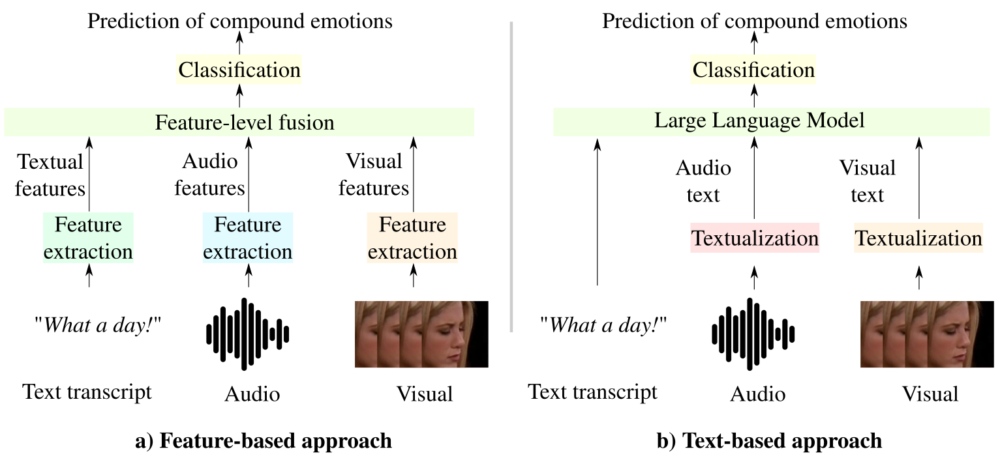

# [Textualized and Feature-based Models for Compound Multimodal Emotion Recognition in the Wild](https://arxiv.org/pdf/2407.12927)


by
**Nicolas Richet<sup>1</sup>,
Soufiane Belharbi<sup>1</sup>,
Haseeb Aslam<sup>1</sup>,
Meike Emilie Schadt<sup>3</sup>,
Manuela González-González<sup>2,3</sup>,
Gustave Cortal<sup>4,6</sup>,
Alessandro Lameiras Koerich<sup>1</sup>,
Marco Pedersoli<sup>1</sup>,
Alain Finkel<sup>4,5</sup>,
Simon Bacon<sup>2,3</sup>,
Eric Granger<sup>1</sup>**

<sup>1</sup> LIVIA, Dept. of Systems Engineering, ÉTS, Montreal, Canada
<br/>
<sup>2</sup> Dept. of Health, Kinesiology \& Applied Physiology, Concordia University, Montreal, Canada
<br/>
<sup>3</sup> Montreal Behavioural Medicine Centre, Montreal, Canada
<br/>
<sup>4</sup> Université Paris-Saclay, CNRS, ENS Paris-Saclay, LMF, 91190, Gif-sur-Yvette, France
<br/>
<sup>5</sup> Institut Universitaire de France, France
<br/>
<sup>6</sup> Université Paris-Saclay, CNRS, LISN, 91400, Orsay, France

<p align="center"></p>

[](https://arxiv.org/pdf/2407.12927)
[](https://github.com/sbelharbi/feature-vs-text-compound-emotion)

[](https://github.com/nicolas-richet/feature-vs-text-compound-emotion)


## Abstract
Systems for multimodal emotion recognition (ER) are commonly trained to extract features from different modalities (e.g., visual, audio, and textual) that are combined to predict individual basic emotions. However, compound emotions often occur in real-world scenarios, and the uncertainty of recognizing such complex emotions over diverse modalities is challenging for feature-based models.
As an alternative, emerging multimodal large language models (LLMs) like BERT and LLaMA rely on explicit non-verbal cues that may be translated from different non-textual modalities (e.g., audio and visual) into text. Textualization of modalities augments data with emotional cues to help the LLM encode the interconnections between all modalities in a shared text space. In such text-based models, prior knowledge of ER tasks is leveraged to textualize relevant nonverbal cues such as audio tone from vocal expressions, and action unit intensity from facial expressions. Since the pre-trained weights are publicly available for many LLMs, training on large-scale datasets is unnecessary, allowing fine-tuning for downstream tasks such as compound ER (CER).
This paper compares the potential of text- and feature-based approaches for compound multimodal ER in videos. Experiments were conducted on the challenging C-EXPR-DB dataset in the wild for CER, and contrasted with results on the MELD dataset for basic ER. Our results indicate that multimodal textualization provides lower accuracy than feature-based models on C-EXPR-DB, where text transcripts are captured in the wild. However, higher accuracy can be achieved when the video data has rich transcripts.
Our code for the Feature-based approach can be found at: [github.com/sbelharbi/feature-vs-text-compound-emotion](https://github.com/sbelharbi/feature-vs-text-compound-emotion). This repository is the text-based approach.

**This code is the text-based approach presented in the paper.**

**Code: Pytorch 2.2.2**, made for the [7th-ABAW challenge](https://affective-behavior-analysis-in-the-wild.github.io/7th/).


## Citation:
```
@article{Richet-abaw-24,
  title={Textualized and Feature-based Models for Compound Multimodal Emotion Recognition in the Wild},
  author={Richet, N. and Belharbi, S. and Aslam, H. and Zeeshan, O. and Belharbi, S. and
  Koerich, A. L. and Pedersoli, M. and Bacon, S. and Granger, E.},
  journal={CoRR},
  volume={abs/2407.12927}
  year={2024}
}
```

## Installation of the environment
```bash
./setup_env.sh
```

## Supported modalities:
- Vision
- Audio
- Text

## Datasets:
For `MELD`, download the videos into the corresponding videos folder \(for example [./MELD/train/videos/](./MELD/train/videos/) for train\).
For `C-EXPR-DB`, download the video into [./C-EXPR-DB](./C-EXPR-DB). Then the videos need to be trimmed according to the annotations, which can be done using the pre-processing described in the [Feature-based Repo](https://github.com/sbelharbi/feature-vs-text-compound-emotion). The trimmed videos should then be put into [./C-EXPR-DB/trimmed_videos](./C-EXPR-DB/trimmed_videos/).

## Pre-processing and Feature Extraction:
1. **First**, the paths in [./constants.py](./constants.py) need to be set correctly. FFMPEG needs to be installed. An access token to the [Llama-3 HuggingFace Repo](https://huggingface.co/meta-llama/Meta-Llama-3-8B) and a [Hume API key](https://dev.hume.ai/docs/introduction/api-key)  are needed for the preprocessing.

2. **Feature Extraction**
Set at the end of [./preprocessing.py](./preprocessing.py) the dataset, device and splits to preprocess. splits are used only for MELD, MELD is large so it is recommended to preprocess each splits separately.

```bash
source venv/bin/activate

python3 preprocessing.py
```

## Training:
Training arguments can be set in [constants.py](./constants.py), and the training can then be launched with:
```bash
source venv/bin/activate

python text_emotion_classification.py
```
